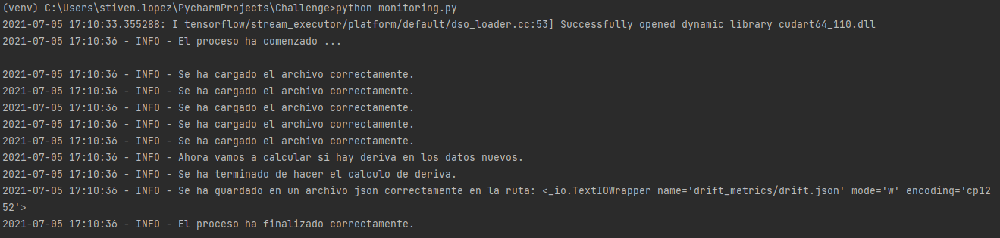

# Challenge

---

El siguiente proyecto tiene como objetivo la construcción de un modelo o algoritmo de Machine Learning con el fin de detectar si una transacción es fraudulenta o no.

Todo el proceso se ha ejecutado en un jupyter notebook, desde la exploración de datos hasta la construcción de los modelos. Sin embargo, se extrajo una muestra aleatoria de los datos con 1000 observaciones con el fin de ejecutar un script para hacer la predicción sobre estos datos y adicional calcular si los datos "nuevos" se alejan de la distribución de los datos de entrenamiento.

## Recrear el ambiente

Es muy importante para garantizar temas de reproducibilidad tener el mismo ambiente con el que se desarrolló, por tanto para hacerlo se debe ejecutar el siguiente código:

```
pip install -r requirements.txt
```

## Instrucciones

---

Para ejecutar el script de predicción, se ejecuta el siguiente código en la terminal donde se tenga el proyecto:

```
python predict.py
```

El código anterior produce la siguiente salida:


Posterior a eso, podemos ejecutar el script de monitoreo que calcula las métricas de Kolmogorov-Smirnov (KS) sobre las variables numéricas con el fin de determinar la distancia máxima entre las funciones de densidad acumulada de dos distribuciones, como referencia se toman las distribuciones de entrenamiento; y para las variables categóricas se aplica la prueba Chi-cuadrado de Pearson. Se debe ejecutar el siguiente código:

```
python monitoring.py
```

Este código produce la siguiente salida:



**Nota**: El monitoreo se hace independientemente del país, es decir, se calculan las distancias entre distribuciones de los datos de entrenamiento de todos los países con respecto a como llegaría un nuevo set de datos para aplicar todos los modelos. Por tanto, una mejora es calcular esto pero para cada set de entrenamiento independiente con respecto a los datos nuevos del país al que correspondan.

Es importante aclarar que la predicción y el monitoreo son scripts sencillos que se crean solo para una muestra, pero a esta parte habría que trabajarle aún mucho más, suponiendo que los modelos ya estuvieran en su mejor rendimiento. 
## Estructura

* La carpeta `config` tiene instanciadas algunas variables que se usan para hacer la predicción y monitoreo sobre datos "nuevos", estas variables están en el archivo `config.py`.
* La carpeta `data` contiene los archivos csv con los datos originales, los datos que se usaron para entrenar, datos "nuevos", y el resultado de la predicción.
* La carpeta `drift_metrics` contiene un archivo `drift.json`  con los resultados del monitoreo.
* La carpeta `models` contiene los modelos serializados que se entrenaron en `modelo.ipynb`.
* La carpeta `utilities` contiene diferentes archivos con funciones creadas para manipulación de datos, visualización, transformadores personalizados, modelamiento, y adicional un archivo con una clase para evaluar el desempeño del modelo.
